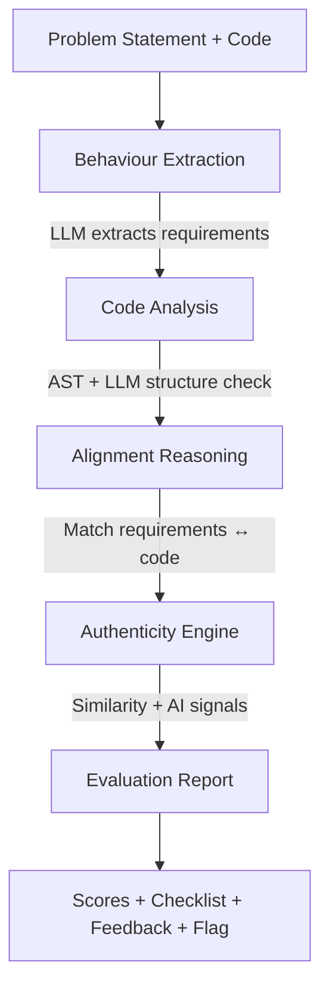

# CodeAlign – AI Coding Assignment Evaluator

**Fair, Fast, and Insightful Code Assessment for the AI Era**

CodeAlign is an AI-powered evaluator built for the **UnsaidTalks Hackathon** that goes beyond "Pass/Fail" to assess **correctness, efficiency, readability, and authenticity** – giving students and reviewers the insights they actually need.

**🎯 Built for:** Students, Instructors, Recruiters, and Bootcamps
**⚡ Speed:** Evaluation in under 30 seconds
**🌐 Languages:** Python, C++, Java, C, JavaScript

---

## 🚀 The Problem

Traditional code evaluation is broken:

- **Manual review** is slow (15+ minutes per submission) and subjective.
- **Auto-graders** only check test cases – they miss code quality, logic depth, and edge-case handling.
- **AI tools are everywhere** – but existing evaluators don't assess originality or authenticity.

**Result:** Students get shallow feedback. Reviewers can't scale.

---

## ✨ The Solution – 4 Dimensions

CodeAlign evaluates submissions across **four critical dimensions**:

### 1. **Problem Alignment & Edge Cases**

- Extracts **requirements and constraints** directly from the problem statement (e.g., "handle empty input", "O(n) expected").
- Checks if the code implements each requirement: ✅ **fulfilled**, ⚠️ **partial**, or ❌ **missing**.
- Produces a **requirement-by-requirement checklist** with evidence.

### 2. **Correctness & Efficiency**

- Uses **static analysis + LLM reasoning** to assess logic correctness.
- Detects **algorithmic complexity** (e.g., O(n²) vs O(n)) from code patterns.
- Compares against the **expected optimal solution** mentioned in the problem.
- Provides actionable suggestions like:
  - _"Consider using a hashmap instead of nested loops to achieve O(n)."_

### 3. **Readability & Best Practices**

- Evaluates variable naming, docstrings, function structure, and modularity.
- Checks adherence to **style standards** (PEP8 for Python, etc.).
- Summarizes **strengths and weaknesses** in plain English.

### 4. **Authenticity (Plagiarism / AI-Use Detection)**

- Computes **similarity** to other submissions using token/AST/embedding-based methods.
- Detects **AI-style patterns** (generic comments, style drift).
- Shows a **separate risk flag** (Low/Moderate/High) with reasons – does **not** penalize the technical score unfairly.

---

## 🏆 Hackathon Alignment (UnsaidTalks Criteria)

CodeAlign directly addresses the evaluation criteria:

| Criterion                     | What CodeAlign Does                                                                                                                                                                                                                               |
| ----------------------------- | ------------------------------------------------------------------------------------------------------------------------------------------------------------------------------------------------------------------------------------------------- |
| **Impact (20%)**              | ⚡ Evaluates in **<30 seconds** with one click<br>📊 Replaces **15 minutes** of manual review<br>🎯 Includes **"Try Sample"** button for instant demo                                                                                             |
| **Innovation (20%)**          | 🧠 **Problem-statement alignment** – extracts and checks requirements dynamically<br>🕵️ **Authenticity flag** – plagiarism detection without unfair penalties<br>🚀 Uses **Groq + Gemini** for fast, accurate AI reasoning                        |
| **Technical Execution (20%)** | 🏗️ **Modular architecture** – clean separation (`alignment/`, `authenticity/`, `api.py`, `ui_app.py`)<br>✅ **Type-hinted, documented, tested** codebase<br>🔧 Real working logic (not placeholder stubs)                                         |
| **User Experience (25%)**     | 🖥️ **Split-screen UI** – inputs on left, results on right<br>📊 **4-quadrant dashboard** – visual scores for Correctness, Efficiency, Space, Readability<br>💬 **Plain-English feedback** – Strengths, Weaknesses, Suggestions, Better Approaches |

---

## 🛠️ System Architecture



**Tech Stack:**

- **Languages:** Python 3.10+
- **LLM:** Groq (Llama 3.3) for reasoning, Gemini for embeddings
- **Frameworks:** FastAPI (backend), Streamlit (UI)
- **Analysis:** Python `ast` module + LLM prompts

---

## 🏃‍♂️ Quick Start

### Prerequisites

- Python 3.10+
- API Keys:
  - **Groq** (for LLM reasoning)
  - **Gemini** (for embeddings)

### Installation

1. **Clone the repository**

   ```bash
   git clone https://github.com/your-username/CodeAlign.git
   cd CodeAlign
   ```

2. **Install dependencies**

   ```bash
   pip install -r requirements.txt
   ```

3. **Configure API keys**
   Create a `.env` file:
   ```env
   GROQ_API_KEY=your_groq_key_here
   GEMINI_API_KEY=your_gemini_key_here
   ```

### Run the App

**Option 1 (Windows):**

```bash
run_app.bat
```

**Option 2 (Linux/Mac):**

```bash
streamlit run src/codealign/ui_app.py
```

The UI will open at `http://localhost:8501`.

---

## 🎮 How to Use

1. **Open the UI**
   - The interface has two sides:
     - **Left:** Input the problem statement and candidate code (paste or upload file)
     - **Right:** View the evaluation report

2. **Try a Sample**
   - Click the "Try Sample" button to auto-fill a classic problem (e.g., "Longest Substring Without Repeating Characters") and see results instantly.

3. **Evaluate Custom Code**
   - Paste your own problem statement
   - Paste or upload candidate code (Python/Java/C++)
   - Click "Evaluate"
   - Wait ~15-30 seconds

4. **Review the Report**
   - You'll see:
     - **Overall Score** (0-100)
     - **Dimension Scores:** Correctness, Time Efficiency, Space Efficiency, Readability
     - **Alignment Checklist:** Per-requirement status (✅ fulfilled, ⚠️ partial, ❌ missing)
     - **Feedback:** Strengths, Weaknesses, Improvement Suggestions
     - **Authenticity Flag:** Low/Moderate/High risk with reasons

---

## 📊 Example Output

For a candidate solving "Longest Substring Without Repeating Characters" with an O(n²) nested loop approach:

**Scores:**

- **Overall:** 74/100
- **Correctness:** 95/100
- **Time Efficiency:** 55/100 (⚠️ O(n²) instead of expected O(n))
- **Space Efficiency:** 90/100
- **Readability:** 70/100

**Alignment Checklist:**

- ✅ Return correct substring length
- ⚠️ Handle empty string (works implicitly, no explicit check)
- ❌ Meet O(n) time complexity (nested loops detected)

**Feedback:**

- **Strengths:** Logic is correct for typical inputs
- **Weaknesses:** Nested loops create O(n²) complexity; no docstring
- **Suggestions:** "Use sliding window with hashmap to achieve O(n)"

**Authenticity:**

- **Risk:** Low (common textbook pattern)

---

## 📁 Repository Structure

```text
CodeAlign/
├── src/
│   └── codealign/
│       ├── alignment/          # Logic for Behaviour & Reasoning
│       │   ├── behaviour_extract.py
│       │   ├── code_analysis.py
│       │   ├── align_reasoner.py
│       │   └── models.py
│       ├── authenticity/       # Plagiarism & AI Detection
│       │   ├── features.py
│       │   ├── similarity.py
│       │   ├── ai_signals.py
│       │   ├── ingest.py
│       │   └── models.py
│       ├── api.py              # FastAPI Backend
│       ├── ui_app.py           # Streamlit Frontend
│       └── cohort_stats.py     # Statistics Calculation
├── tests/                      # Unit & Integration Tests
│   ├── test_core_flow.py
│   ├── test_align_reasoner.py
│   └── ...
├── examples/                   # Sample Inputs (Python, C++, Java)
├── requirements.txt            # Project Dependencies
├── .env.example                # Template for API Keys
├── run_app.bat                 # Windows Launcher
├── DEMO_GUIDE.md               # Hackathon Presentation Script
├── DEPLOYMENT_GUIDE.md         # Deployment Instructions
└── README.md                   # Project Documentation
```

---

## 🎯 What Makes CodeAlign Different

| Feature              | Traditional Auto-Graders | CodeAlign                                      |
| :------------------- | :----------------------- | :--------------------------------------------- |
| **Correctness**      | ✅ Test cases only       | ✅ Test logic + edge-case analysis             |
| **Efficiency**       | ❌ Not checked           | ✅ Complexity hints + comparison to expected   |
| **Readability**      | ❌ Ignored               | ✅ Naming, docs, structure scoring             |
| **Problem Intent**   | ❌ Not verified          | ✅ Requirement-by-requirement checklist        |
| **Authenticity**     | ❌ Not checked           | ✅ Plagiarism/AI-use flag (non-punitive)       |
| **Feedback Quality** | ❌ "Pass/Fail"           | ✅ Strengths, weaknesses, concrete suggestions |
| **Speed**            | ⚡ Fast (seconds)        | ⚡ Fast (~30 seconds)                          |

---

## 📝 Sample Problems Included

CodeAlign comes with 4 ready-to-test samples covering different scenarios:

1. **Python – Longest Substring (Optimal O(n))**
   - Expected Score: ~88-92/100
   - Tests: Edge case handling, optimal complexity, good documentation

2. **Python – Two Sum (Brute Force O(n²))**
   - Expected Score: ~68-74/100
   - Tests: Correct logic but sub-optimal complexity detection

3. **Java – Valid Parentheses (Optimal)**
   - Expected Score: ~90-94/100
   - Tests: Multi-language support, stack-based optimal solution

4. **C++ – Merge Two Sorted Lists (Optimal)**
   - Expected Score: ~87-91/100
   - Tests: Pointer manipulation, O(1) space, clear comments

Click "Try Sample" in the UI to load any of these instantly.

---

## 🔮 Future Enhancements

- **Multi-language support:** Full Java, C++, JavaScript support via `tree_sitter`
- **Test execution:** Optional integration with test runners for deeper correctness validation
- **LMS integration:** Canvas, Moodle, Google Classroom plugins
- **Cohort analytics:** Dashboards showing which requirements students commonly miss
- **Better solution sketches:** Auto-generate high-level pseudocode for optimal approaches
- **Real-time collaboration:** Live code review sessions with instant feedback

---

## 📹 Demo Video

[📺 Watch the 5-minute demo](#)

---

## 🤝 Contributing

This is a hackathon project built for the **UnsaidTalks AI Coding Assignment Evaluator Challenge**. Feedback and suggestions are welcome!

To contribute:

1. Fork the repository
2. Create a feature branch (`git checkout -b feature/amazing-feature`)
3. Commit your changes (`git commit -m 'Add amazing feature'`)
4. Push to the branch (`git push origin feature/amazing-feature`)
5. Open a Pull Request

---

## 📄 License

**MIT License**
Built for the UnsaidTalks Hackathon, February 2026

---

## 👥 Team

- **[Your Name]** – [GitHub](#) | [LinkedIn](#)
- **[Teammate 1]** – [GitHub](#) | [LinkedIn](#)
- **[Teammate 2]** – [GitHub](#) | [LinkedIn](#)

---

## 🙏 Acknowledgments

- **UnsaidTalks** for organizing the hackathon challenge
- **Groq** and **Gemini** for providing API access
- Inspiration from tools like Codequiry, Moss, and modern LLM-based code reviewers
- The open-source community for `tree_sitter`, `ast`, and Python tooling

---

## 📊 Scoring Methodology

CodeAlign uses a weighted scoring system:

```text
Overall Score = 35% × Correctness + 25% × Time Efficiency + 15% × Space Efficiency + 20% × Readability ± 5% Authenticity Modifier
```

**Where:**

- **Correctness:** Logic correctness + edge case handling
- **Time Efficiency:** Algorithmic complexity vs expected
- **Space Efficiency:** Memory usage patterns
- **Readability:** Naming, docs, structure, style adherence
- **Authenticity:** Low risk = +5 bonus, High risk = -10 penalty

This ensures that strong technical solutions score well even if they use common patterns, while authenticity concerns are flagged separately for human review.

---

## 🐛 Troubleshooting

- **Issue:** `ModuleNotFoundError` when running the app
  - **Solution:** Make sure you've installed dependencies: `pip install -r requirements.txt`

- **Issue:** API key errors
  - **Solution:** Check your `.env` file has valid keys for both `GROQ_API_KEY` and `GEMINI_API_KEY`

- **Issue:** Streamlit won't start
  - **Solution:** Try `python -m streamlit run src/codealign/ui_app.py`

- **Issue:** Evaluation takes too long
  - **Solution:** Check your internet connection; LLM API calls require stable connectivity

For other issues, please open an issue on GitHub.

---

## 🚀 Ready to evaluate? Clone the repo and try the "Try Sample" button!

```bash
git clone https://github.com/your-username/CodeAlign.git
cd CodeAlign
pip install -r requirements.txt
streamlit run src/codealign/ui_app.py
```
